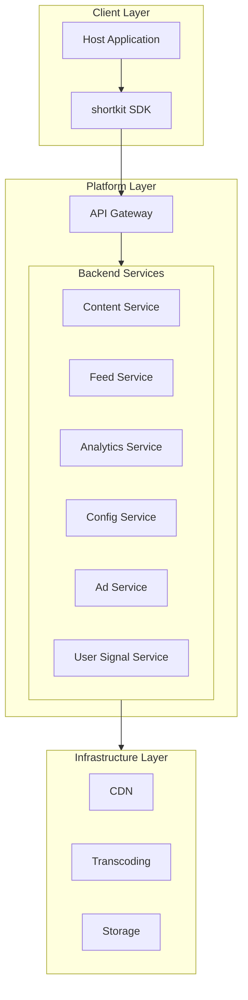
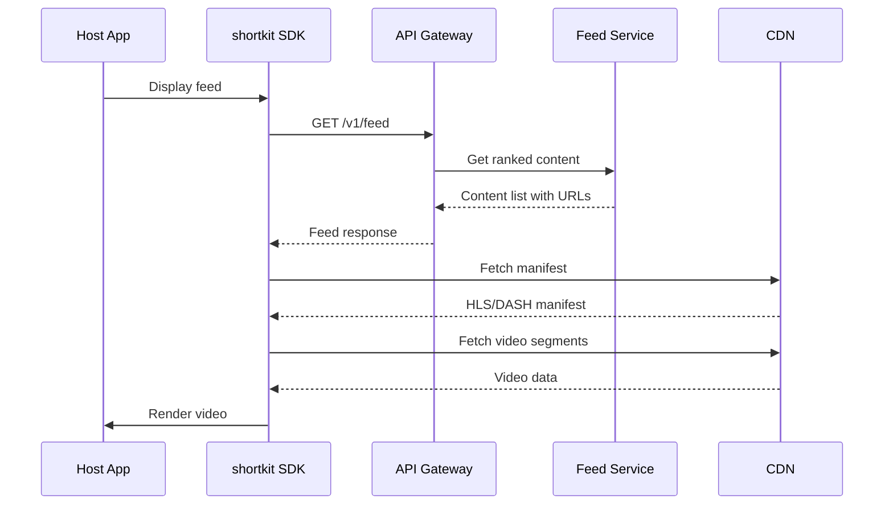
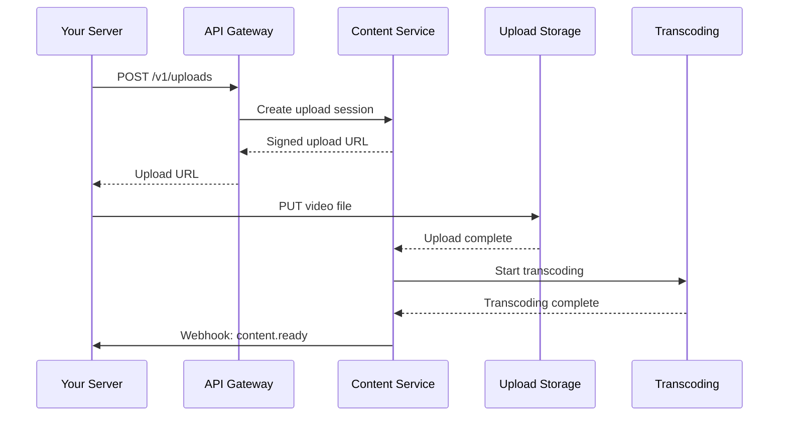
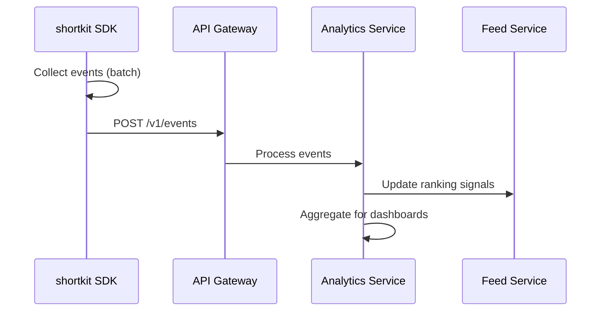

This page provides a technical overview of how shortkit's components work together to deliver short-form video experiences.

## High-level architecture

```
Host Application → Client SDK → Platform API Gateway → Backend Services → Infrastructure Layer
```

The system is structured as three tightly integrated but independently deployable layers:



## Client SDK layer

The Client SDK is embedded within your host application. It handles:

- **Feed UI rendering** - Vertical/horizontal scrolling video feed with configurable controls
- **Video playback** - Custom media pipelines with adaptive bitrate streaming
- **Signal collection** - Engagement events (impressions, watch time, completions)
- **Remote configuration** - Fetching config overlays and A/B test variants
- **Ad integration** - Native ad rendering via Google IMA SDK

<Note>
  The SDK communicates exclusively with the Platform API Gateway. It never communicates directly with underlying infrastructure services.
</Note>

### Platform-specific implementations

| Platform | Player Architecture |
|----------|-------------------|
| **iOS** | Custom pipeline on AVFoundation (AVSampleBufferDisplayLayer, AudioToolbox). Bypasses AVPlayer to enable DASH, multi-codec ABR, and granular buffer control. |
| **Android** | Built on Media3/ExoPlayer with custom extensions for buffer management and signal collection. |
| **React Native** | Native bridge to iOS and Android implementations. Single SDK package detects platform and delegates accordingly. |
| **Web** | Custom player using hls.js (HLS) and dash.js (DASH) with unified API surface. |

## Platform API Gateway

A unified API layer exposing all platform capabilities. The Gateway handles:

- **Authentication** - Validates API keys (publishable for SDK, secret for server-to-server)
- **Routing** - Directs requests to appropriate backend services
- **Rate limiting** - Enforces per-organization request limits
- **Request validation** - Ensures payload correctness before processing

All requests are authenticated via:
- **Organization-level API keys** for SDK requests (publishable key in `X-API-Key` header)
- **User-level tokens** for Admin Portal requests (secret key as Bearer token)

## Backend services

### Content Service

Manages video assets throughout their lifecycle:

- Creates content records on upload
- Triggers transcoding jobs
- Manages metadata (title, description, tags, custom fields)
- Handles content state transitions (processing → ready → live → archived)

### Feed Service

Computes personalized, ranked feeds for each request:

- Applies signal-weighted ranking algorithm
- Incorporates editorial overrides (pin, boost, suppress)
- Enforces content filters and geo-targeting rules
- Returns content with streaming URLs and metadata

### Analytics Service

Ingests and processes engagement events:

- **Real-time processing** - Updates ranking signals within 60 seconds
- **Aggregate reporting** - Computes hourly/daily rollups for dashboards
- **Quality metrics** - Tracks startup time, rebuffering, errors

### Config Service

Manages remote SDK configuration:

- Stores configuration overlays per organization
- Handles A/B experiment definitions and variant assignments
- Delivers sparse config responses (only fields that differ from defaults)

### Ad Service

Manages advertising integration:

- Ad placement configuration and frequency rules
- Proxies ad requests via Google IMA
- Aggregates ad performance metrics (impressions, CPM, fill rate)

### User Signal Service

Stores per-user engagement profiles:

- Keyed by host app's user identifier (or anonymous device ID)
- Tracks topic affinities based on viewing history
- Supports identity resolution (merging anonymous → identified)

## Infrastructure layer

### Transcoding pipeline

On ingest, every video is processed into:

- **ABR ladder** - Multiple quality renditions in H.264 and AV1 codecs
- **Streaming manifests** - HLS (.m3u8) and DASH (.mpd) outputs
- **Thumbnails** - First-frame images at each rendition resolution
- **Preview assets** - Animated GIFs for mini-player widgets
- **Storyboard sprites** - Scrubber thumbnail previews
- **Auto-captions** - Server-side speech-to-text (optional)

<Accordion title="ABR rendition ladder">
  | Rendition | Resolution | H.264 Bitrate | AV1 Bitrate |
  |-----------|------------|---------------|-------------|
  | 1080p | 1920×1080 | ~4,500 kbps | ~2,500 kbps |
  | 720p | 1280×720 | ~2,500 kbps | ~1,500 kbps |
  | 480p | 854×480 | ~1,200 kbps | ~700 kbps |
  | 360p | 640×360 | ~700 kbps | ~400 kbps |
  | 240p | 426×240 | ~400 kbps | ~250 kbps |
  | 144p | 256×144 | ~200 kbps | ~120 kbps |
</Accordion>

### CDN delivery

Video segments, manifests, and assets are served via CDN:

- **Edge caching** - Popular content cached at edge nodes closest to users
- **Origin shield** - Mid-tier cache reduces origin load
- **Signed URLs** - Time-limited tokens prevent unauthorized access
- **Branded domains** - Custom CNAME support (e.g., `video.yourcompany.com`)

### Storage

Durable storage for:
- Original source files
- Transcoded segments and manifests
- Thumbnails and preview assets
- Caption tracks

## Data flow examples

### Video playback



### Content upload



### Engagement tracking



## Authentication model

### API keys

Each organization receives two keys:

| Key Type | Prefix | Usage | Security |
|----------|--------|-------|----------|
| **Publishable** | `pk_` | SDK initialization, feed requests | Safe for client-side code |
| **Secret** | `sk_` | Server-to-server API, Admin Portal | Never expose in client code |

### User identity

The SDK manages user identity in two phases:

1. **Anonymous** - Device-generated UUID on first launch
2. **Identified** - Your app's user ID after authentication

Identity resolution merges anonymous engagement data with the identified profile, preserving history across the transition.

## Security

- All API communication over TLS 1.2+
- API keys hashed at rest
- Signed CDN URLs with configurable expiry (default: 6 hours)
- Webhook requests signed with HMAC-SHA256
- Per-organization data isolation

## Performance targets

| Metric | Target |
|--------|--------|
| Feed API response (p50) | < 100ms |
| Feed API response (p99) | < 500ms |
| Video start time (pre-buffered) | < 300ms |
| Video start time (feed entry) | < 1 second |
| Config fetch (p99) | < 200ms |
| Event → ranking signal | < 60 seconds |

## Next steps

<Columns cols={2}>
  <Card title="SDK overview" icon="mobile" href="/sdk/overview">
    Learn about the Client SDK capabilities.
  </Card>
  <Card title="API reference" icon="code" href="/api-reference/introduction">
    Explore the complete API documentation.
  </Card>
</Columns>
