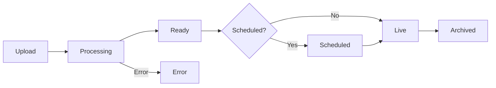

shortkit's video infrastructure handles everything from content upload to delivery, so you can focus on creating content rather than building video pipelines.

## Infrastructure components

<Columns cols={2}>
  <Card title="Content ingestion" icon="upload" href="/infrastructure/content-ingestion">
    Multiple upload methods including direct upload, server-side upload, and automated pipelines.
  </Card>
  <Card title="Transcoding" icon="film" href="/infrastructure/transcoding">
    Multi-codec ABR ladder generation with H.264 and AV1, plus thumbnails, previews, and captions.
  </Card>
  <Card title="CDN delivery" icon="globe" href="/infrastructure/cdn-delivery">
    Global edge caching with signed URLs, branded domains, and playback restrictions.
  </Card>
  <Card title="Feed ranking" icon="ranking-star" href="/infrastructure/feed-ranking">
    Signal-weighted content ranking with editorial controls and configurable weights.
  </Card>
</Columns>

## Content lifecycle

Every piece of content flows through a defined lifecycle:



| Status | Description |
|--------|-------------|
| `processing` | Video is being transcoded and assets generated |
| `ready` | Processing complete, not yet visible in feeds |
| `scheduled` | Set to go live at a future date/time |
| `live` | Visible in feeds and available for playback |
| `archived` | Removed from feeds, still accessible via direct link |
| `error` | Processing failed, requires attention |

## Supported formats

### Input formats

The platform accepts all common video formats:

| Category | Supported |
|----------|-----------|
| **Containers** | MP4, MOV, MKV, WebM, AVI |
| **Video codecs** | H.264, H.265/HEVC, VP9, AV1, ProRes |
| **Audio codecs** | AAC, MP3, Opus, PCM |
| **Max resolution** | 4K (3840×2160) |
| **Max file size** | 5 GB |

### Output formats

Every video is transcoded into:

- **HLS** (`.m3u8`) - For iOS and Safari
- **DASH** (`.mpd`) - For Android and modern browsers
- **Progressive MP4** - For short content optimization

## Quality renditions

Videos are encoded into an adaptive bitrate ladder:

| Rendition | Resolution | H.264 Bitrate | AV1 Bitrate |
|-----------|------------|---------------|-------------|
| 1080p | 1920×1080 | ~4,500 kbps | ~2,500 kbps |
| 720p | 1280×720 | ~2,500 kbps | ~1,500 kbps |
| 480p | 854×480 | ~1,200 kbps | ~700 kbps |
| 360p | 640×360 | ~700 kbps | ~400 kbps |
| 240p | 426×240 | ~400 kbps | ~250 kbps |
| 144p | 256×144 | ~200 kbps | ~120 kbps |

<Tip>
  AV1 provides equivalent quality at roughly 40% lower bitrate. The SDK automatically selects AV1 on devices with hardware decode support (iPhone 15+, recent Android flagships).
</Tip>

## Generated assets

Beyond the video itself, the platform generates:

| Asset | Description |
|-------|-------------|
| **First-frame thumbnails** | Per-rendition images matching video resolution |
| **Preview GIF/WebP** | First 3 seconds, looped, at 360p |
| **Storyboard sprites** | Thumbnail strip for scrubber previews |
| **Auto-captions** | Server-side speech-to-text (optional) |

## Global delivery

Content is served via a global CDN with:

- **Edge caching** at 200+ locations worldwide
- **Origin shield** to reduce origin load
- **Signed URLs** with configurable expiry
- **Branded domains** (e.g., `video.yourcompany.com`)

Average delivery metrics:

| Metric | Target |
|--------|--------|
| First byte (edge hit) | < 50ms |
| First byte (origin) | < 200ms |
| Availability | 99.99% |

## Processing times

| Content Length | Typical Processing Time |
|----------------|------------------------|
| < 30 seconds | 1-2 minutes |
| 1 minute | 2-3 minutes |
| 5 minutes | 5-8 minutes |
| 10 minutes | 10-15 minutes |

Processing includes full ABR ladder generation (H.264 + AV1), thumbnails, preview GIF, and storyboard sprites.

## Webhooks

Get notified when content is ready or encounters errors:

```json
{
  "event": "content.ready",
  "data": {
    "contentId": "cnt_abc123",
    "title": "My Video",
    "duration": 45.2,
    "status": "ready"
  },
  "timestamp": "2024-02-04T12:00:00Z"
}
```

See [Webhooks guide](/guides/webhooks) for setup instructions.

## Infrastructure abstraction

shortkit abstracts all underlying infrastructure:

- **No vendor lock-in**: We handle provider relationships
- **No exposed IDs**: All identifiers are shortkit-native
- **No CDN URLs**: All URLs use your branded domain
- **Automatic failover**: Redundant infrastructure across regions

This abstraction allows us to optimize and upgrade infrastructure without any changes to your integration.

## Next steps

<Columns cols={2}>
  <Card title="Content ingestion" icon="upload" href="/infrastructure/content-ingestion">
    Learn about upload methods and metadata.
  </Card>
  <Card title="Transcoding" icon="film" href="/infrastructure/transcoding">
    Understand the encoding pipeline.
  </Card>
</Columns>
