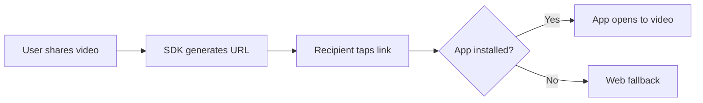

Deep linking allows users to share content from your video feed and have recipients open that specific video directly in your app.

## How it works

When a user taps the share button, the SDK generates a shareable URL. When the recipient taps this link:

1. If they have your app installed, it opens directly to the video
2. If not, they're taken to a web fallback (your website or app store)



## Configuration

### SDK configuration

Configure the deep link format in your SDK initialization:

```typescript
ShortKit.initialize({
  apiKey: 'pk_live_your_publishable_key',
  config: {
    controls: {
      share: {
        enabled: true,
        deepLinkDomain: 'yourapp.com',
        deepLinkPathTemplate: '/watch/{contentId}'
      }
    }
  }
});
```

This generates URLs like: `https://yourapp.com/watch/cnt_abc123`

### Admin Portal configuration

You can also configure deep link settings in the Admin Portal:

1. Go to **Settings → Deep Links**
2. Set your deep link domain
3. Configure the path template
4. Set fallback URLs for users without the app

## Platform setup

### iOS (Universal Links)

<Steps>
  <Step title="Configure Associated Domains">
    In Xcode, go to your target's **Signing & Capabilities** and add **Associated Domains**:

    ```
    applinks:yourapp.com
    ```
  </Step>
  <Step title="Create apple-app-site-association file">
    Host this file at `https://yourapp.com/.well-known/apple-app-site-association`:

    ```json apple-app-site-association
    {
      "applinks": {
        "apps": [],
        "details": [
          {
            "appID": "TEAMID.com.yourcompany.yourapp",
            "paths": ["/watch/*"]
          }
        ]
      }
    }
    ```

    <Warning>
      This file must be served with `Content-Type: application/json` and no redirects. HTTPS is required.
    </Warning>
  </Step>
  <Step title="Handle incoming URLs">
    ```swift SceneDelegate.swift
    import shortkit

    class SceneDelegate: UIResponder, UIWindowSceneDelegate {

        func scene(_ scene: UIScene, continue userActivity: NSUserActivity) {
            guard userActivity.activityType == NSUserActivityTypeBrowsingWeb,
                  let url = userActivity.webpageURL else {
                return
            }

            handleDeepLink(url)
        }

        private func handleDeepLink(_ url: URL) {
            // Extract content ID from URL
            // e.g., yourapp.com/watch/cnt_abc123
            let pathComponents = url.pathComponents
            if let watchIndex = pathComponents.firstIndex(of: "watch"),
               watchIndex + 1 < pathComponents.count {
                let contentId = pathComponents[watchIndex + 1]
                ShortKit.openContent(contentId)
            }
        }
    }
    ```

    For SwiftUI apps, use the `onOpenURL` modifier:

    ```swift ContentView.swift
    import shortkit
    import SwiftUI

    struct ContentView: View {
        var body: some View {
            MainTabView()
                .onOpenURL { url in
                    handleDeepLink(url)
                }
        }

        private func handleDeepLink(_ url: URL) {
            if let contentId = extractContentId(from: url) {
                ShortKit.openContent(contentId)
            }
        }
    }
    ```
  </Step>
</Steps>

### Android (App Links)

<Steps>
  <Step title="Update AndroidManifest.xml">
    Add an intent filter to your main activity:

    ```xml AndroidManifest.xml
    <activity android:name=".MainActivity">
        <intent-filter android:autoVerify="true">
            <action android:name="android.intent.action.VIEW" />
            <category android:name="android.intent.category.DEFAULT" />
            <category android:name="android.intent.category.BROWSABLE" />
            <data
                android:scheme="https"
                android:host="yourapp.com"
                android:pathPrefix="/watch" />
        </intent-filter>
    </activity>
    ```
  </Step>
  <Step title="Create assetlinks.json">
    Host this file at `https://yourapp.com/.well-known/assetlinks.json`:

    ```json assetlinks.json
    [
      {
        "relation": ["delegate_permission/common.handle_all_urls"],
        "target": {
          "namespace": "android_app",
          "package_name": "com.yourcompany.yourapp",
          "sha256_cert_fingerprints": [
            "AA:BB:CC:DD:..."
          ]
        }
      }
    ]
    ```

    Get your SHA-256 fingerprint:
    ```bash
    keytool -list -v -keystore your-keystore.jks -alias your-alias
    ```
  </Step>
  <Step title="Handle incoming intents">
    ```kotlin MainActivity.kt
    import android.content.Intent
    import android.os.Bundle
    import androidx.appcompat.app.AppCompatActivity
    import dev.shortkit.ShortKit

    class MainActivity : AppCompatActivity() {

        override fun onCreate(savedInstanceState: Bundle?) {
            super.onCreate(savedInstanceState)
            handleIntent(intent)
        }

        override fun onNewIntent(intent: Intent) {
            super.onNewIntent(intent)
            handleIntent(intent)
        }

        private fun handleIntent(intent: Intent) {
            val data = intent.data ?: return

            // Extract content ID from URL
            // e.g., yourapp.com/watch/cnt_abc123
            val pathSegments = data.pathSegments
            val watchIndex = pathSegments.indexOf("watch")
            if (watchIndex >= 0 && watchIndex + 1 < pathSegments.size) {
                val contentId = pathSegments[watchIndex + 1]
                ShortKit.openContent(contentId)
            }
        }
    }
    ```
  </Step>
</Steps>

### React Native

<Tabs>
  <Tab title="React Native CLI">
    ```tsx App.tsx
    import { useEffect } from 'react';
    import { Linking } from 'react-native';
    import { ShortKit } from '@shortkit/react-native';

    export default function App() {
      useEffect(() => {
        // Handle initial URL (app was closed)
        Linking.getInitialURL().then(url => {
          if (url) handleDeepLink(url);
        });

        // Handle URL while app is open
        const subscription = Linking.addEventListener('url', ({ url }) => {
          handleDeepLink(url);
        });

        return () => subscription.remove();
      }, []);

      const handleDeepLink = (url: string) => {
        const match = url.match(/\/watch\/(\w+)/);
        if (match) {
          ShortKit.openContent(match[1]);
        }
      };

      return (/* Your app */);
    }
    ```
  </Tab>
  <Tab title="Expo">
    ```tsx App.tsx
    import * as Linking from 'expo-linking';
    import { ShortKit } from '@shortkit/expo';

    export default function App() {
      const url = Linking.useURL();

      useEffect(() => {
        if (url) {
          const { path } = Linking.parse(url);
          if (path?.startsWith('watch/')) {
            const contentId = path.replace('watch/', '');
            ShortKit.openContent(contentId);
          }
        }
      }, [url]);

      return (/* Your app */);
    }
    ```

    Configure in `app.json`:

    ```json app.json
    {
      "expo": {
        "scheme": "yourapp",
        "ios": {
          "associatedDomains": ["applinks:yourapp.com"]
        },
        "android": {
          "intentFilters": [
            {
              "action": "VIEW",
              "autoVerify": true,
              "data": [
                {
                  "scheme": "https",
                  "host": "yourapp.com",
                  "pathPrefix": "/watch"
                }
              ],
              "category": ["BROWSABLE", "DEFAULT"]
            }
          ]
        }
      }
    }
    ```
  </Tab>
</Tabs>

### Web

```typescript router.ts
import { ShortKit } from '@shortkit/web';

function handleRoute() {
  const path = window.location.pathname;
  const match = path.match(/\/watch\/(\w+)/);

  if (match) {
    ShortKit.openContent(match[1]);
  }
}

// Check on page load
handleRoute();

// Listen for navigation
window.addEventListener('popstate', handleRoute);
```

With React Router:

```tsx WatchPage.tsx
import { useEffect } from 'react';
import { useParams } from 'react-router-dom';
import { ShortKit, ShortKitFeed } from '@shortkit/web/react';

export function WatchPage() {
  const { contentId } = useParams<{ contentId: string }>();

  useEffect(() => {
    if (contentId) {
      ShortKit.openContent(contentId);
    }
  }, [contentId]);

  return <ShortKitFeed />;
}
```

## SDK methods

### openContent

Navigate to a specific content item:

```typescript
ShortKit.openContent('cnt_abc123');
```

The feed will:
1. Fetch the specified content
2. Insert it at the top of the feed
3. Begin playback immediately

### getShareUrl

Programmatically get a share URL for content:

```typescript
const shareUrl = ShortKit.getShareUrl('cnt_abc123');
// https://yourapp.com/watch/cnt_abc123
```

### Custom share handling

Override the default share behavior:

```typescript
<ShortKitFeed
  onShareRequested={async (content) => {
    const url = content.shareUrl;

    // Custom share logic
    if (navigator.share) {
      await navigator.share({
        title: content.title,
        text: `Check out this video: ${content.title}`,
        url: url
      });
    } else {
      await navigator.clipboard.writeText(url);
      showToast('Link copied!');
    }
  }}
/>
```

## Web fallback

For users who don't have your app installed, configure a fallback experience:

### Option 1: Web player

If you have the web SDK integrated, the same deep link URL can render a web player:

```tsx pages/watch/[contentId].tsx
// Next.js example
import { ShortKitFeed } from '@shortkit/web/react';
import { useParams } from 'next/navigation';

export default function WatchPage() {
  const { contentId } = useParams();

  return (
    <div className="mobile-container">
      <ShortKitFeed startContentId={contentId} />
    </div>
  );
}
```

### Option 2: App store redirect

Redirect to the app store with the deep link preserved:

```typescript
// Server-side or edge function
export function handleWatchRoute(contentId: string, userAgent: string) {
  const isIOS = /iPhone|iPad|iPod/.test(userAgent);
  const isAndroid = /Android/.test(userAgent);

  if (isIOS) {
    // iOS: Try Universal Link first, then App Store
    return Response.redirect(
      `https://apps.apple.com/app/yourapp/id123456789?` +
      `mt=8&ct=deeplink&pt=contentId_${contentId}`
    );
  }

  if (isAndroid) {
    // Android: Play Store with referrer
    return Response.redirect(
      `https://play.google.com/store/apps/details?id=com.yourcompany.yourapp&` +
      `referrer=utm_source%3Ddeeplink%26contentId%3D${contentId}`
    );
  }

  // Desktop: Show web player or landing page
  return renderWebPlayer(contentId);
}
```

## Testing deep links

### iOS

```bash
# Test Universal Link
xcrun simctl openurl booted "https://yourapp.com/watch/cnt_test123"

# Verify apple-app-site-association
curl -I https://yourapp.com/.well-known/apple-app-site-association
```

### Android

```bash
# Test App Link
adb shell am start -a android.intent.action.VIEW \
  -d "https://yourapp.com/watch/cnt_test123" \
  com.yourcompany.yourapp

# Verify assetlinks.json
curl https://yourapp.com/.well-known/assetlinks.json
```

## Next steps

<Columns cols={2}>
  <Card title="Engagement signals" icon="signal" href="/sdk/engagement-signals">
    Understand the events collected by the SDK.
  </Card>
  <Card title="Analytics" icon="chart-bar" href="/admin-portal/analytics">
    View share and engagement analytics.
  </Card>
</Columns>
