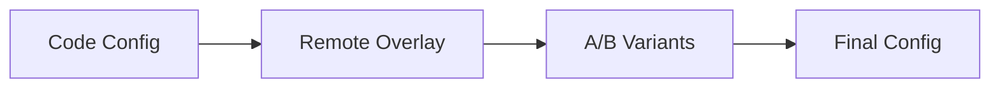

The shortkit Client SDK delivers production-grade short-form video feeds to your mobile and web applications. It handles video playback, adaptive streaming, engagement tracking, and ad integration while providing extensive customization options.

## Capabilities

<Columns cols={2}>
  <Card title="Video playback" icon="play">
    Custom media pipelines with adaptive bitrate streaming, intelligent prefetch, and near-instant playback on swipe.
  </Card>
  <Card title="Feed UI" icon="rectangle-vertical-history">
    Configurable vertical or horizontal scrolling feeds with smooth transitions and gesture handling.
  </Card>
  <Card title="Engagement tracking" icon="chart-line">
    Automatic collection of impressions, watch time, completions, and interactions for analytics and personalization.
  </Card>
  <Card title="Ad integration" icon="rectangle-ad">
    Native in-feed advertising via Google IMA SDK with configurable frequency and styling.
  </Card>
  <Card title="Theming" icon="palette">
    Full control over colors, fonts, and control styling to match your brand.
  </Card>
  <Card title="Extensibility" icon="puzzle-piece">
    Custom overlay components, interaction hooks, and metadata pass-through for deep integration.
  </Card>
</Columns>

## Supported platforms

| Platform | Language | Distribution | Minimum Version |
|----------|----------|--------------|-----------------|
| iOS | Swift | Swift Package Manager | iOS 14.0+ |
| Android | Kotlin | Maven | Android 7.0+ (API 24) |
| React Native | TypeScript | npm | RN 0.70+ |
| Expo | TypeScript | npm | Expo SDK 49+ |
| Web | TypeScript | npm, CDN | Modern browsers |

## Player architecture

shortkit uses custom media pipelines optimized for short-form video performance:

<Tabs>
  <Tab title="iOS">
    Built on low-level AVFoundation APIs (`AVSampleBufferDisplayLayer`, `AudioToolbox`) rather than `AVPlayer`. This enables:

    - **DASH protocol support** - Not available with standard AVPlayer
    - **Multi-codec ABR** - AV1 + H.264 quality selection
    - **Granular buffer control** - Precise prefetch and read-ahead management
    - **Frame-accurate seeking** - Instant scrubber response

    This architecture matches what companies like YouTube and Netflix use for their iOS players.
  </Tab>
  <Tab title="Android">
    Built on Media3/ExoPlayer with custom extensions:

    - **Optimized buffer management** - Tuned for short-form content patterns
    - **Signal collection hooks** - Deep integration with engagement tracking
    - **Multi-codec support** - Hardware-accelerated AV1 on supported devices
    - **Background playback** - Picture-in-Picture support
  </Tab>
  <Tab title="React Native">
    Native bridge architecture:

    - Single npm package for both platforms
    - Platform detection delegates to iOS or Android native implementation
    - Full feature parity with native SDKs
    - TypeScript types for configuration and callbacks
  </Tab>
  <Tab title="Web">
    Built on industry-standard libraries:

    - **hls.js** for HLS playback
    - **dash.js** for DASH playback
    - Unified API surface across protocols
    - React component bindings included
  </Tab>
</Tabs>

## Protocol support

| Protocol | iOS | Android | Web |
|----------|-----|---------|-----|
| HLS | Yes | Yes | Yes |
| DASH | Yes | Yes | Yes |
| Progressive MP4 | Yes | Yes | Yes |

<Tip>
  For very short content (under 15 seconds), the SDK may use progressive MP4 instead of segmented streaming. The overhead of HLS/DASH segment negotiation can exceed the cost of downloading a small file outright.
</Tip>

## Initialization

The SDK follows a consistent initialization pattern across platforms:

```typescript
ShortKit.initialize({
  apiKey: 'pk_live_your_publishable_key',
  config: FeedConfig,
  environment: 'production' | 'staging' | 'development',
  remoteConfigTTL: 300,      // Cache TTL in seconds (default: 5 min)
  remoteConfigTimeout: 2000  // Fetch timeout in ms (default: 2s)
});
```

Initialization is **non-blocking**. The feed begins rendering immediately with code-level defaults while remote configuration is fetched in the background.

### Post-initialization methods

```typescript
// Associate user identity for personalization
ShortKit.setUserId('user_12345');

// Clear identity on logout (generates new anonymous ID)
ShortKit.clearUserId();
```

## Configuration hierarchy

The SDK uses a layered configuration model:

1. **Code-level config** - Passed at initialization, serves as baseline and fallback
2. **Remote config overlay** - Fetched from server, contains only overridden fields
3. **A/B variants** - Experiment-specific overrides included in remote config



If remote config fetch fails, the SDK gracefully falls back to cached config (if available) or code-level defaults. The feed never blocks waiting for configuration.

## Feed rendering

Display the feed using platform-appropriate components:

<Tabs>
  <Tab title="iOS (SwiftUI)">
    ```swift
    import shortkit
    import SwiftUI

    struct VideoTab: View {
        var body: some View {
            ShortKitFeedView()
                .edgesIgnoringSafeArea(.all)
        }
    }
    ```
  </Tab>
  <Tab title="iOS (UIKit)">
    ```swift
    import shortkit
    import UIKit

    class VideoViewController: UIViewController {
        override func viewDidLoad() {
            super.viewDidLoad()
            let feedView = ShortKit.createFeedView()
            feedView.frame = view.bounds
            view.addSubview(feedView)
        }
    }
    ```
  </Tab>
  <Tab title="Android (Compose)">
    ```kotlin
    import dev.shortkit.compose.ShortKitFeed

    @Composable
    fun VideoTab() {
        ShortKitFeed(
            modifier = Modifier.fillMaxSize()
        )
    }
    ```
  </Tab>
  <Tab title="Android (View)">
    ```kotlin
    import dev.shortkit.ShortKit

    class VideoActivity : AppCompatActivity() {
        override fun onCreate(savedInstanceState: Bundle?) {
            super.onCreate(savedInstanceState)
            val feedView = ShortKit.createFeedView(this)
            setContentView(feedView)
        }
    }
    ```
  </Tab>
  <Tab title="React Native">
    ```tsx
    import { ShortKitFeed } from '@shortkit/react-native';

    export function VideoTab() {
      return <ShortKitFeed style={{ flex: 1 }} />;
    }
    ```
  </Tab>
  <Tab title="Web">
    ```tsx
    import { ShortKitFeed } from '@shortkit/web/react';

    export function VideoTab() {
      return <ShortKitFeed />;
    }
    ```
  </Tab>
</Tabs>

## Platform guides

<Columns cols={2}>
  <Card title="iOS SDK" icon="apple" href="/sdk/ios">
    Swift integration with UIKit and SwiftUI support.
  </Card>
  <Card title="Android SDK" icon="android" href="/sdk/android">
    Kotlin integration with View and Compose support.
  </Card>
  <Card title="React Native SDK" icon="react" href="/sdk/react-native">
    Cross-platform integration for React Native and Expo.
  </Card>
  <Card title="Web SDK" icon="globe" href="/sdk/web">
    Browser integration with React bindings.
  </Card>
</Columns>

## Configuration guides

<Columns cols={2}>
  <Card title="Feed configuration" icon="sliders" href="/sdk/configuration">
    Layout, controls, and behavior options.
  </Card>
  <Card title="Theming" icon="palette" href="/sdk/theming">
    Colors, fonts, and visual customization.
  </Card>
  <Card title="Deep linking" icon="link" href="/sdk/deep-linking">
    Shareable links and content navigation.
  </Card>
  <Card title="Engagement signals" icon="signal" href="/sdk/engagement-signals">
    Event collection and analytics integration.
  </Card>
</Columns>
